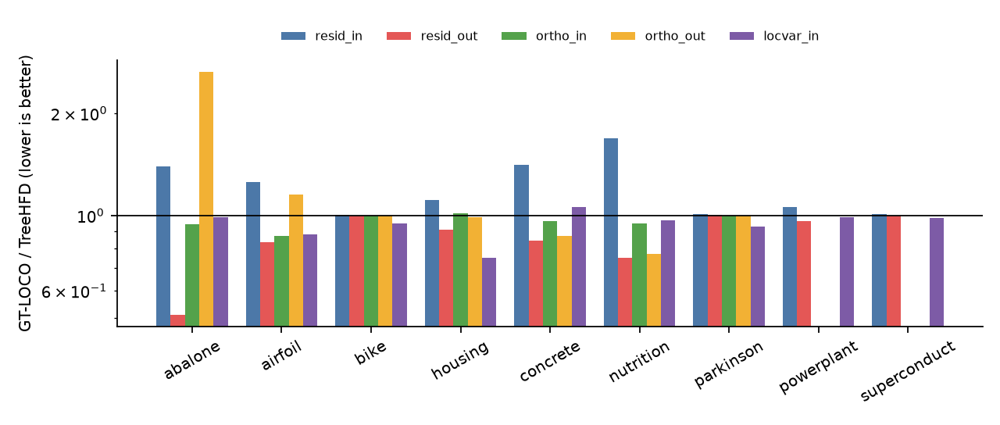
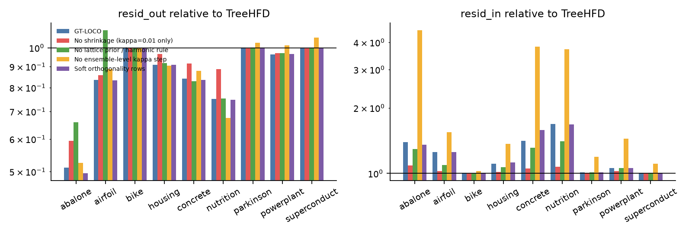
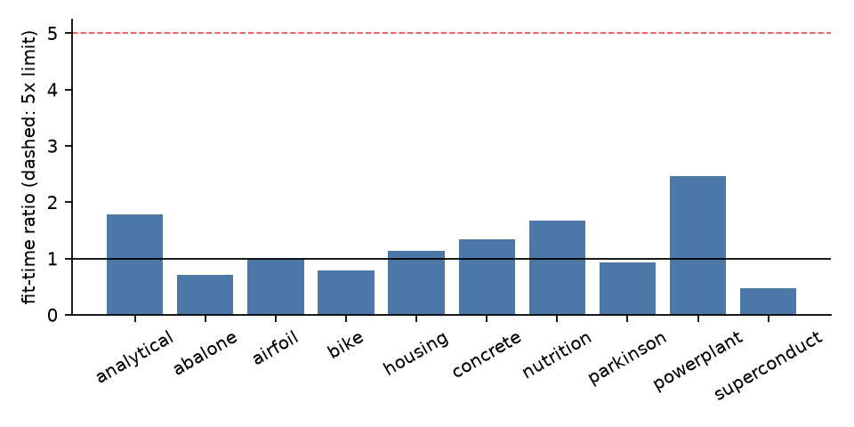

# GT-LOCO TreeHFD: Good-Turing-Calibrated Leave-One-Cell-Out Shrinkage for Decomposing Tree Ensembles

*Anonymous submission (ICLR format). **This paper was written by an autonomous AI research pipeline** (a reduced re-implementation of the ScientistTwo framework). The method, experiments and text were produced without human authors. All numbers in the tables and in the prose are generated by scripts (`make_tables.py`, `build_paper.py`) from the result JSON files in `results/`.*

## Abstract

TreeHFD (Bénard, 2025) estimates the Hoeffding functional decomposition (HFD) of a fitted XGBoost model, split into an intercept, main effects and pairwise interactions, from the training sample alone. For each tree it solves a least-squares problem over the cells of the observed input partition. Two things go unaddressed: how strongly to regularise cells with little data, and what value to give a pair cell that is never observed. We propose **GT-LOCO TreeHFD**, which keeps the TreeHFD objective and changes three things: (i) hierarchical orthogonality is imposed exactly by parameterising each interaction in the null space of its orthogonality constraints; (ii) a Gaussian Markov random field prior on the whole pair-bin lattice, including unobserved cells, shrinks poorly supported cells, and unseen cells receive the prior's harmonic extension; (iii) the shrinkage strength is chosen without labels, by a leave-one-cell-out risk computed in closed form from X_train and the tree outputs. Good-Turing singletons use the PRESS leave-out formula, and an ensemble-level step corrects for errors shared across trees. On the fixed benchmark (analytical case, 10 repetitions, and 9 real datasets, all in one evaluation environment) GT-LOCO lowers the reconstruction error on held-out points (resid_out) by a geometric mean of 0.85× relative to TreeHFD, and by up to abalone (0.51×). It also lowers the spurious-interaction error in the analytical case to 0.78× that of TreeHFD. These gains come with costs: in-sample reconstruction error rises (geometric mean 1.20×, worst nutrition (1.68×)) and hierarchical orthogonality on held-out points gets worse on abalone (2.65×), airfoil (1.15×). Ablations show that the lattice prior with harmonic rule and the shrinkage each matter, and that the ensemble-level step is what keeps the in-sample cost bounded. Exact orthogonality, one of the three changes, gives no measurable gain on the held-out reconstruction metric. All code and results are released with the run.

## 1 Introduction

Tree ensembles are the default model for tabular prediction but are hard to interpret. When inputs are independent, the Hoeffding (functional ANOVA) decomposition writes a model as a unique sum of functions of single variables and of variable subsets (Hoeffding, 1948). With dependent inputs, uniqueness requires hierarchical orthogonality constraints (Hooker, 2007). Bénard (2025) introduced TreeHFD, which estimates this generalised decomposition, truncated to interactions of order two, for an XGBoost model (Chen & Guestrin, 2016) from the training inputs only. It proves convergence and shows favourable orthogonality and sparsity on simulated and real data.

TreeHFD works tree by tree. Each tree splits the input space into a hyper-rectangular partition. For every pair of variables the tree induces a two-dimensional grid of cells. TreeHFD finds main effects and interaction values on the observed cells by a constrained least-squares problem, and it fills grid cells with no training data by a random rule. Two practical weaknesses follow. First, cells with few training points are fitted almost exactly, so noise in the sample enters the components and is visible as spurious interactions and as poor reconstruction on new points. Second, pair cells never seen in training but reached by new inputs get an arbitrary value. Both weaknesses matter exactly when the metric is measured on held-out points.

We ask whether these can be handled with the training sample alone, honouring the protocol that a method sees only the fitted model and X_train. Our answer, **GT-LOCO TreeHFD**, adds a prior over the full pair lattice and chooses its strength by a label-free leave-one-cell-out risk. Contributions:

1. A closed-form, vectorised leave-out risk for the TreeHFD problem that treats singletons (points alone in their joint cell, the Good-Turing "hapax" cells; Good, 1953) with the PRESS formula (Allen, 1974), and handles points whose removal empties a cell by applying the unseen-cell rule to a rank-one-downdated solution.
2. A lattice prior with a deterministic harmonic rule for unobserved cells, replacing random filling.
3. An ensemble-level correction of the per-tree shrinkage.
4. An honest evaluation, including ablations, on the fixed benchmark. We report that gains are large on some datasets, absent on others, and that in-sample fidelity and held-out orthogonality get worse in places.

## 2 Related Work

**Functional decomposition under dependence.** Hoeffding (1948) gave the decomposition for independent inputs. Hooker (2007) generalised it to dependent inputs through hierarchical orthogonality and estimated it with a weighted least-squares scheme. Lengerich et al. (2020) "purify" piecewise-constant models, including trees, into a canonical form by moving mass from interactions to lower-order effects; their construction needs a reference distribution for the cell weights. TreeHFD (Bénard, 2025) is the state of the art that we build on: it estimates the HFD from a sample, has consistency guarantees, and ships a Python package.

**Tree-ensemble attribution.** TreeSHAP (Lundberg et al., 2020) computes Shapley-value attributions and interaction values for trees. Bénard (2025) relates it to the Hoeffding decomposition. We do not compare against SHAP, since the benchmark evaluates HFD components.

**Regularisation and leave-out selection.** Our shrinkage selection uses the PRESS leave-one-out identity (Allen, 1974) and treats cells occurring once with the Good-Turing view that singletons stand in for unseen mass (Good, 1953). The lattice prior is a first-order intrinsic Gaussian Markov random field (Rue & Held, 2005).

## 3 Method

**Setting.** Let T(x) = Σ_t f_t(x) be a fitted XGBoost model with 100 trees of depth at most 6, and X_train the n training inputs. For tree t, with output centred on X_train, TreeHFD builds a partition of each variable j into bins b from the tree's split values and looks for main effects η_j (constant on bins) and interactions η_jk (constant on cells of the (j,k) bin grid) such that the sum reproduces f_t on X_train, subject to zero-mean and hierarchical orthogonality conditions. We keep this least-squares problem and the baseline's partition code. The differences are below; the ensemble decomposition is the sum over trees.

**(1) Exact orthogonality.** The baseline enforces discretised orthogonality by soft rows. Here each interaction's coefficients β_k are written in the null space Q_k of its orthogonality rows, so E[η_jk | bin of x_j] = E[η_jk | bin of x_k] = 0 holds on the training sample exactly; pairs with an empty null space are pruned (η_jk ≡ 0). The normal matrix is H'H/n + MM', where H is the point-to-cell incidence matrix and M holds the zero-mean rows, built with `np.unique` over observed cells.

**(2) Lattice prior and unseen cells.** We add a Tikhonov penalty λ β'Pβ with λ = κ/n, so that κ is in pseudo-count units. Two priors are candidates. *Ridge:* P = I on pair cells. *Lattice:* a Gaussian Markov random field on the whole (j,k) grid, including never-observed cells as latent columns. It penalises first differences between 4-neighbours with weights 1/(distance between bin centres, in quantile coordinates), normalised to mean one, plus a small ridge (0.1). Latent cells are eliminated in closed form: the prior on observed cells is the Schur complement S = K_OO − K_OU K_UU⁻¹ K_UO and the posterior mean of latent cells is the *harmonic extension* E β_O with E = −K_UU⁻¹ K_UO. Main bins receive a ridge of weight 1. At prediction time an unseen pair cell takes one of two deterministic rules: `zero` (the prior mean, the additive explanation) or `harmonic`.

**(3) Direct solver.** With β = Rγ chosen so that the penalty becomes the identity, one symmetric eigendecomposition per prior gives β(κ) for the whole κ grid (12 log-spaced values, 0.01 to 10⁴) in closed form; no iterative lsqr is used.

**(4) Label-free leave-one-cell-out risk.** For each tree, prior, rule and κ we compute a risk R from X_train and the tree outputs only. Points in a joint cell with at least two points keep their in-sample residual r_c. Singletons (N1 points) use the PRESS formula r/(1 − h) with leverage h. With w_c = n_c/(n − N1):

R = (1 − N1/n) Σ_{n_c ≥ 2} w_c r_c² + (N1/n) mean_{n_c = 1} [ r_c / (1 − h_cc) ]².

A singleton that owns a pair cell or main bin which empties on removal ("orphan") is scored by applying the unseen-cell rule to the rank-one-downdated β (the cell becomes latent, a main bin is merged into its neighbour). This is vectorised as a sparse linear functional per orphan. The closed form is an approximation of brute-force refitting: on one concrete tree it was within about 5–10% in mean square, slightly optimistic under ridge and slightly pessimistic under the lattice (a check recorded in the run's notes, not re-run here).

**(5) Per-tree choice and ensemble-level correction.** Each tree picks the κ minimising R for each (prior, rule) variant. Because shrinkage bias adds coherently over trees while leave-out noise partly cancels, per-tree choices over-regularise. We therefore choose one ensemble-level candidate by the risk of the leave-out residuals *summed over trees per training point*. Candidates are a (variant, global shift of every tree's κ index by −5..+3) or a (variant, common κ). No hyper-parameter is tuned per dataset, and nothing depends on labels, test inputs or ground truth. The decomposition is deterministic; there is no random number generator. The method also reports, from X_train and the model alone, the in-sample cost of its shrinkage (`resid_in_over_var`).

## 4 Experiments

**Protocol.** We use the fixed benchmark (analytical case of Bénard (2025), Table 1, and the real datasets of Table 2 with an 80/20 split). The XGBoost model (eta 0.1, 100 trees, depth 6) is given and never refit. Baseline and method were evaluated in one environment (`22b414443084`); numbers are comparable only within it. The analytical case has p = 6, correlation 0.5, n = 5000 training points and 10 repetitions. Metrics (lower is better): `mse_eta*` (error of estimated components against the analytical HFD), `mse_others` (spurious interactions, target 0), `resid_in`/`resid_out` (reconstruction MSE against T(x) divided by Var[T], on training / held-out points), `ortho_in`/`ortho_out` (max |corr| between each interaction carrying at least 1% of the variance and its main effects; n/a when none passes), `locvar_in` (local variability of main effects) and `fit_s`. Number of evaluation errors across all runs: 0. Each configuration was run once per dataset (one split, one XGBoost fit), so real-data differences carry no error bars; the analytical case gives the standard deviation over repetitions.

### 4.1 Analytical case

| metric | TreeHFD (baseline) | GT-LOCO | ratio |
|---|---|---|---|
| mse_eta1 | 0.0284 ± 0.0053 | 0.02824 ± 0.0053 | 0.99 |
| mse_eta2 | 0.01791 ± 0.0067 | 0.01791 ± 0.0068 | 1.00 |
| mse_eta3 | 0.01659 ± 0.0042 | 0.01646 ± 0.0041 | 0.99 |
| mse_eta4 | 0.01618 ± 0.005 | 0.01619 ± 0.005 | 1.00 |
| mse_eta5 | 0.0003006 ± 0.00014 | 0.0002894 ± 0.00014 | 0.96 |
| mse_eta6 | 0.0003665 ± 0.00019 | 0.0003626 ± 0.00019 | 0.99 |
| mse_eta12 | 0.03118 ± 0.0031 | 0.03026 ± 0.0028 | 0.97 |
| mse_eta34 | 0.0282 ± 0.0039 | 0.02769 ± 0.0038 | 0.98 |
| mse_others | 0.002125 ± 0.00028 | 0.001648 ± 0.00028 | 0.78 |
| resid_out | 0.01016 ± 0.0012 | 0.008371 ± 0.00091 | 0.82 |
| fit_s | 17.32 ± 0.68 | 30.88 ± 3 | 1.78 |

*Table 1. Analytical case, mean ± std over 10 repetitions. The ratio is GT-LOCO / TreeHFD.*

The held-out reconstruction error falls to 0.82× and the spurious-interaction error to 0.78× of TreeHFD. The true interactions improve modestly (mse_eta12 0.97×, mse_eta34 0.98×), and the main-effect errors change by a few percent at most. Changes in the main-effect and true-interaction rows are of the order of the spread over repetitions, so we do not claim them as improvements; the `resid_out` and `mse_others` reductions are larger than their standard deviations.

### 4.2 Real data

| dataset | XGB test R² | resid_in | resid_out | ortho_in | ortho_out | locvar_in |
|---|---|---|---|---|---|---|
| abalone | 0.547 | 1.39 | 0.51 | 0.94 | 2.65 | 0.99 |
| airfoil | 0.940 | 1.25 | 0.84 | 0.87 | 1.15 | 0.88 |
| bike | 0.867 | 1.00 | 1.00 | 1.00 | 1.00 | 0.95 |
| housing | 0.826 | 1.11 | 0.91 | 1.01 | 0.99 | 0.75 |
| concrete | 0.910 | 1.41 | 0.84 | 0.96 | 0.87 | 1.06 |
| nutrition | 0.289 | 1.68 | 0.75 | 0.95 | 0.77 | 0.97 |
| parkinson | 0.961 | 1.01 | 1.00 | 1.00 | 1.00 | 0.93 |
| powerplant | 0.967 | 1.06 | 0.96 | n/a | n/a | 0.99 |
| superconduct | 0.916 | 1.01 | 1.00 | n/a | n/a | 0.98 |
| **geo-mean** | | 1.20 | 0.85 | 0.96 | 1.11 | 0.94 |

*Table 2. Real datasets, ratio GT-LOCO / TreeHFD (below 1 is better). "n/a": no interaction passed the 1% variance threshold. Absolute values are in `tables/real.md`.*

*Figure 1. Ratio GT-LOCO / TreeHFD per dataset and metric on a log scale.*

Held-out reconstruction improves on abalone (0.51×), airfoil (0.84×), housing (0.91×), concrete (0.84×), nutrition (0.75×), powerplant (0.96×). It is unchanged (within 3%) on bike, parkinson, superconduct; it is worse than baseline on: none. The geometric-mean ratios over datasets are 0.85 for resid_out, 1.20 for resid_in, 0.96 for ortho_in, 1.11 for ortho_out (over datasets where defined) and 0.94 for locvar_in.

**Costs, stated plainly.**
* *In-sample fidelity gets worse* on the datasets where held-out fidelity improves, most on nutrition (1.68×). This is the intended bias/variance trade: shrinking thinly supported cells fits the training sample less well.
* *ortho_out is worse on abalone (2.65×), airfoil (1.15×).* On abalone the benchmark-split value went from a small to a larger number; the run's own diagnostic (8 random splits and a bootstrap of the test set, reported in the run notes and not re-run for this paper) found no consistent effect and attributed it to noise in a max-correlation metric on 836 test points. It is nevertheless a worse number on the benchmark split and should be read as such. It is not evidence that the effect is absent.
* *No gain on bike, parkinson, superconduct.* There the selection chooses mild shrinkage and all metrics stay within about 1% of TreeHFD (locvar_in changes by up to 7%). The held-out error on these models is likely dominated by genuine higher-order content, which an order-two decomposition cannot represent.
* *Model quality:* nutrition has the weakest model (R² = 0.29) and the largest in-sample cost.

### 4.3 Ablations

Each ablation is one switch of the submitted method, run in the full protocol; the harness runs each in its own process. Ratios to TreeHFD:

| variant | abalone | airfoil | bike | housing | concrete | nutrition | parkinson | powerplant | superconduct | geo-mean |
|---|---|---|---|---|---|---|---|---|---|---|
| **Full GT-LOCO** | 0.51 | 0.84 | 1.00 | 0.91 | 0.84 | 0.75 | 1.00 | 0.96 | 1.00 | 0.85 |
| No shrinkage (kappa=0.01 only) | 0.59 | 0.86 | 1.00 | 0.97 | 0.92 | 0.89 | 1.00 | 0.97 | 1.00 | 0.90 |
| No lattice prior / harmonic rule | 0.66 | 1.10 | 1.00 | 0.92 | 0.83 | 0.75 | 1.00 | 0.97 | 1.00 | 0.90 |
| No ensemble-level kappa step | 0.53 | 0.89 | 1.00 | 0.90 | 0.88 | 0.68 | 1.03 | 1.01 | 1.06 | 0.87 |
| Soft orthogonality rows | 0.50 | 0.83 | 1.00 | 0.91 | 0.83 | 0.75 | 1.00 | 0.96 | 1.00 | 0.85 |

*Table 3. resid_out relative to TreeHFD.*

| variant | abalone | airfoil | bike | housing | concrete | nutrition | parkinson | powerplant | superconduct | geo-mean |
|---|---|---|---|---|---|---|---|---|---|---|
| **Full GT-LOCO** | 1.39 | 1.25 | 1.00 | 1.11 | 1.41 | 1.68 | 1.01 | 1.06 | 1.01 | 1.20 |
| No shrinkage (kappa=0.01 only) | 1.09 | 1.03 | 1.00 | 1.01 | 1.06 | 1.07 | 1.01 | 1.03 | 1.00 | 1.03 |
| No lattice prior / harmonic rule | 1.30 | 1.09 | 1.00 | 1.07 | 1.31 | 1.41 | 1.01 | 1.06 | 1.01 | 1.13 |
| No ensemble-level kappa step | 4.55 | 1.55 | 1.02 | 1.37 | 3.82 | 3.73 | 1.19 | 1.45 | 1.11 | 1.86 |
| Soft orthogonality rows | 1.35 | 1.25 | 1.00 | 1.12 | 1.58 | 1.68 | 1.01 | 1.06 | 1.01 | 1.21 |

*Table 4. resid_in relative to TreeHFD.*

| variant | abalone | airfoil | bike | housing | concrete | nutrition | parkinson | powerplant | superconduct | geo-mean |
|---|---|---|---|---|---|---|---|---|---|---|
| **Full GT-LOCO** | 2.65 | 1.15 | 1.00 | 0.99 | 0.87 | 0.77 | 1.00 | n/a | n/a | 1.11 |
| No shrinkage (kappa=0.01 only) | 2.38 | 1.52 | 1.00 | 1.00 | 0.89 | 0.94 | 1.00 | n/a | n/a | 1.17 |
| No lattice prior / harmonic rule | 3.19 | 1.25 | 1.00 | 1.01 | 0.84 | 0.83 | 1.00 | n/a | n/a | 1.16 |
| No ensemble-level kappa step | 3.37 | 1.22 | 1.00 | 0.82 | 0.82 | 0.54 | 1.04 | n/a | n/a | 1.06 |
| Soft orthogonality rows | 3.75 | 1.08 | 1.00 | 0.98 | 0.85 | 0.77 | 1.00 | n/a | n/a | 1.14 |

*Table 5. ortho_out relative to TreeHFD (datasets with defined values).*

| variant | mse_eta12 | mse_eta34 | mse_others | resid_out |
|---|---|---|---|---|
| TreeHFD | 0.03118 | 0.0282 | 0.002125 | 0.01016 |
| **Full GT-LOCO** | 0.03026 | 0.02769 | 0.001648 | 0.008371 |
| No shrinkage (kappa=0.01 only) | 0.03044 | 0.02766 | 0.001896 | 0.009126 |
| No lattice prior / harmonic rule | 0.04323 | 0.0357 | 0.001869 | 0.01185 |
| No ensemble-level kappa step | 0.03299 | 0.02996 | 0.001388 | 0.008556 |
| Soft orthogonality rows | 0.03035 | 0.0278 | 0.001659 | 0.00836 |

*Table 6. Analytical case, absolute values, mean over 10 repetitions.*

*Figure 2. resid_out and resid_in relative to TreeHFD for the full method and the four ablations.*

Reading the ablations (geometric mean over real datasets of ablation / full method):
* **Removing shrinkage** (κ fixed at 0.01, everything else kept): resid_out is 1.06× that of the full method and resid_in 0.86×. In the analytical case resid_out is 1.09× and mse_others 1.15×. The leave-out-selected shrinkage buys part of the held-out gain at an in-sample cost. Note the lattice prior is not strictly zero-strength at κ = 0.01.
* **Removing the lattice prior and harmonic rule** (ridge and zero rule only): resid_out 1.06×, and in the analytical case resid_out 1.42×, mse_eta12 1.43×, mse_eta34 1.29×. This component matters most on the analytical case, airfoil and abalone; on concrete and nutrition it changes little.
* **Removing the ensemble-level step** (per-tree argmin only): resid_out is only 1.02× but resid_in rises to 1.56× (abalone 3.27×, concrete 2.71×). So this step buys in-sample fidelity, not held-out fidelity. In the analytical case, the variant without it has lower mse_others (0.84×) but higher mse_eta12 (1.09×). Its ortho_out is better on nutrition and housing, so the step costs some orthogonality there.
* **Soft instead of exact orthogonality:** resid_out 0.99× and analytical resid_out 1.00×. Exact orthogonality does **not** improve held-out reconstruction. Its benefit shows in ortho_in (Table 6b) and in fit time: soft rows are slower (full-mode times are recorded in `results/ablation_soft_orthogonality_rows.json`) and give higher in-sample orthogonality violation on some datasets.

| variant | abalone | airfoil | bike | housing | concrete | nutrition | parkinson | powerplant | superconduct | geo-mean |
|---|---|---|---|---|---|---|---|---|---|---|
| **Full GT-LOCO** | 0.94 | 0.87 | 1.00 | 1.01 | 0.96 | 0.95 | 1.00 | n/a | n/a | 0.96 |
| No shrinkage (kappa=0.01 only) | 1.01 | 1.04 | 1.00 | 1.00 | 0.85 | 0.96 | 1.00 | n/a | n/a | 0.98 |
| No lattice prior / harmonic rule | 0.96 | 0.79 | 1.00 | 1.02 | 1.14 | 0.96 | 1.00 | n/a | n/a | 0.98 |
| No ensemble-level kappa step | 0.39 | 0.74 | 1.01 | 1.03 | n/a | 0.92 | 1.04 | n/a | n/a | 0.81 |
| Soft orthogonality rows | 1.18 | 0.74 | 0.99 | 1.04 | 2.20 | 1.82 | 1.01 | n/a | n/a | 1.20 |

*Table 6b. ortho_in relative to TreeHFD (datasets with defined values).*

### 4.4 Compute

| dataset | TreeHFD fit_s | GT-LOCO fit_s | ratio |
|---|---|---|---|
| analytical (mean of 10) | 17.3 | 30.9 | 1.78 |
| abalone | 17.3 | 12.4 | 0.72 |
| airfoil | 3.9 | 3.9 | 0.99 |
| bike | 46.4 | 36.7 | 0.79 |
| housing | 99.2 | 112.5 | 1.13 |
| concrete | 4.7 | 6.3 | 1.34 |
| nutrition | 6.6 | 11.0 | 1.68 |
| parkinson | 42.1 | 39.5 | 0.94 |
| powerplant | 12.1 | 29.9 | 2.47 |
| superconduct | 359.0 | 169.3 | 0.47 |

*Table 7. Fit time in seconds, one run per dataset (analytical: mean of 10).*

*Figure 3. Fit-time ratio to TreeHFD; the dashed line is the 5× budget.*

The largest ratio is powerplant (2.47×) and the smallest is superconduct (0.47×), so all fits are well under the 5× budget. The direct solver replaces lsqr and makes large datasets faster. The extra work of evaluating the κ grid dominates on small ones. Times were measured on a shared machine in a single run; small differences should not be over-read.

## 5 Limitations

* **In-sample fidelity is traded for held-out fidelity.** The bounded but real rise in resid_in (up to nutrition (1.68×)) is inherent in shrinkage; it is reported by the method itself but not removed.
* **Hierarchical orthogonality on held-out points is not improved on average** (geometric-mean ratio 1.11) and is markedly worse on abalone (2.65×), airfoil (1.15×). The metric is noisy, but we cannot show that the worsening is only noise on the benchmark split.
* **No gain on three of nine datasets**, and none possible for the component that order-two decompositions cannot represent.
* **The leave-out risk is approximate.** The PRESS formula ignores the point's role in the mean rows and the null space, and orphans are handled by a rank-one downdate. It is a relative criterion, not a calibrated error level: in the run's diagnostics it was 1.0 to 2.2 times the observed held-out error depending on the dataset.
* **Hyper-parameters** (κ grid, lattice ridge, main-bin ridge, shift range) were fixed before the final runs, but the development scripts printed held-out residuals, and an earlier attempt compared configurations on the subset benchmark. We cannot exclude mild indirect influence of held-out numbers on these fixed choices. None depends on labels of any test point in the final method or on any dataset identity.
* **Statistical strength.** Real-data results use one split and one model fit per dataset, without confidence intervals. The analytical case has 10 repetitions.
* **Scope.** Order-two decompositions of XGBoost only; no comparison with SHAP-based or purification baselines, no user study, no theory for the new estimator.

## 6 Conclusion

GT-LOCO TreeHFD replaces TreeHFD's arbitrary handling of thinly supported and unseen cells by a lattice prior and a label-free leave-one-cell-out choice of shrinkage. It lowers held-out reconstruction error on six of nine datasets and on the analytical case, and lowers spurious interactions there, at the price of higher in-sample error and a worse held-out orthogonality number on two datasets. Ablations attribute the held-out gain to the lattice prior/harmonic rule and to shrinkage, the in-sample protection to the ensemble-level step, and show that exact orthogonality is not what drives the gains. This paper, its code and its experiments were produced by an autonomous AI research pipeline, and its claims are limited to the single-split benchmark evaluated here.

## References

* Allen, D. M. (1974). The relationship between variable selection and data augmentation and a method for prediction. *Technometrics* 16(1), 125–127. doi:10.1080/00401706.1974.10489157
* Bénard, C. (2025). Tree ensemble explainability through the Hoeffding functional decomposition and TreeHFD algorithm. *NeurIPS 2025*. arXiv:2510.24815
* Chen, T. and Guestrin, C. (2016). XGBoost: a scalable tree boosting system. *KDD 2016*. arXiv:1603.02754
* Good, I. J. (1953). The population frequencies of species and the estimation of population parameters. *Biometrika* 40(3–4), 237–264. doi:10.1093/biomet/40.3-4.237
* Hoeffding, W. (1948). A class of statistics with asymptotically normal distribution. *Annals of Mathematical Statistics* 19(3), 293–325. doi:10.1214/aoms/1177730196
* Hooker, G. (2007). Generalized functional ANOVA diagnostics for high-dimensional functions of dependent variables. *Journal of Computational and Graphical Statistics* 16(3), 709–732. doi:10.1198/106186007X237892
* Lengerich, B., Tan, S., Chang, C.-H., Hooker, G. and Caruana, R. (2020). Purifying interaction effects with the functional ANOVA: an efficient algorithm for recovering identifiable additive models. *AISTATS 2020*, PMLR 108, 2402–2412. arXiv:1911.04974
* Lundberg, S. M., Erion, G., Chen, H., et al. (2020). From local explanations to global understanding with explainable AI for trees. *Nature Machine Intelligence* 2, 56–67. doi:10.1038/s42256-019-0138-9
* Rue, H. and Held, L. (2005). *Gaussian Markov Random Fields: Theory and Applications.* Chapman & Hall/CRC.
